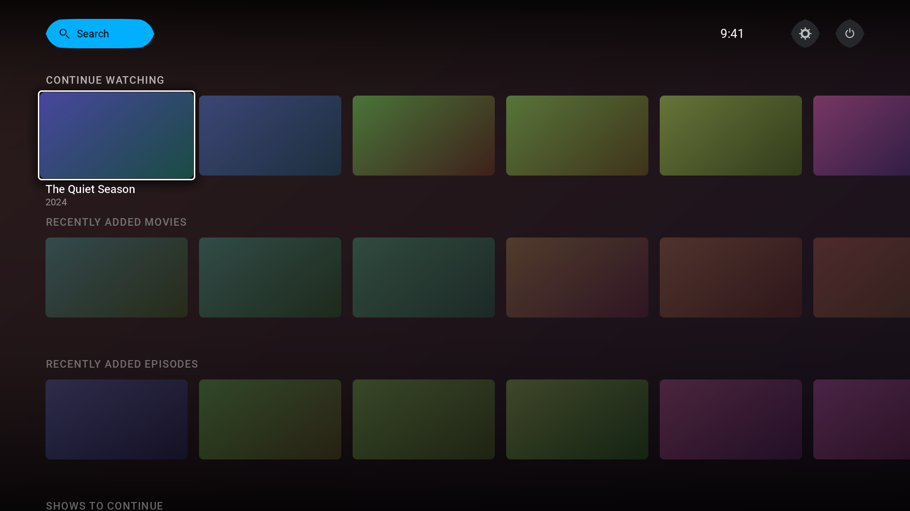

# kodi-22-themes

Custom skins for **Kodi 22 "Piers"**, built for a remote control at ten feet and
tuned to stay smooth on low-power boxes (Fire TV Stick, Raspberry Pi) as well as
desktop.

| Skin | Add-on id | Status |
|---|---|---|
| **Cable TV** — ten-foot launcher: rows of artwork cards, focused row pinned to the top | `skin.cable.tv` | installable, home screen built |
| **Cable Retro** — retro console dashboard, switchable between two console styles | `skin.cable.retro` | not started |
| **Cable Stream** — hero billboard and poster carousels | `skin.cable.stream` | not started |
| **Cable Skins** — repository add-on, so the skins update through Kodi's add-on browser | `repository.cable.skins` | built, untested on hardware |



*Rendered by `tools/preview_home.py` from the skin's own constants, colours,
textures and fonts. It is not a Kodi screenshot — see [Why there is a
linter](#why-there-is-a-linter).*

## Cable TV: what is done

- **Home screen** — top bar (search, clock, settings, power) and rows of 16:9
  cards. The focused row pins to the top of the screen and the focused card
  holds the left keyline while the row scrolls beneath it. Rows: Continue
  watching, Recently added movies, Recently added episodes, Shows to continue,
  Movies, Recently added albums, Games, and a static shortcuts row that works on
  an empty library.
- **Global restyle** — every other window, including ones neither of us will
  open, is dark, flat, Roboto and accent-focused, via `colors/defaults.xml`,
  `Defaults.xml`, and in-place regeneration of the Estuary textures that ~170
  inherited call sites point at.
- **Five accent colours** — Settings → Interface → Skin → Colours.
- **Typography** — Roboto, with real baked weights and a tracked face for row
  headings.

Still to do: the library view layouts, the info dialogs and OSDs, the Games
screens, and a skin-settings page for the row toggles (the toggles themselves
work, they just have no UI yet — `no_row_continue`, `no_row_recentmovies`,
`no_row_recentepisodes`, `no_row_inprogresstv`, `no_row_randommovies`,
`no_row_music`, `no_row_games`, and `backdrop_mode` set to `art`, `thumb` or
`off`, all settable with `Skin.SetBool` / `Skin.SetString`).

All three are derivative works of **Estuary**, Kodi's default skin. See
[`NOTICE.md`](NOTICE.md) for the licence and attribution chain.

## Install

Two things before anything else.

**1. Turn on unknown sources.** *Settings → System → Add-ons → Unknown sources*
(setting id `addons.unknownsources`). Kodi refuses to install anything that did
not come from its official repository until this is on.

**2. Know about the 10-second prompt.** When you switch skin, Kodi shows
**"Keep skin?" — "Would you like to keep this change?"** and gives you about
**ten seconds** to answer. If you do not answer, it silently reverts to the
previous skin. This is the single most common reason to think a new skin "didn't
work", so have the remote in your hand and press Yes.

Reassurance before you start: **a broken skin cannot leave Kodi unusable.** If a
skin fails to load, Kodi resets `lookandfeel.skin` back to the default skin by
itself and shows *"Unable to load skin — Skin is missing some files"*. Worst case
you are back in Estuary. See [If something goes wrong](#if-something-goes-wrong).

> **The `raw.githubusercontent.com` links below only work while this repository
> is public.** Kodi cannot authenticate to GitHub, so if the repo is private,
> skip to building the zip from a clone (still in Option A) or to Option C.
> `python3 tools/check_urls.py` will tell you which situation you are in.

### Option A — install the zip (works everywhere)

The most reliable route, and the one to use first.

**Get the zip.** Either download it in a browser:

```
https://raw.githubusercontent.com/AshtonCable/kodi-22-themes/main/dist/skin.cable.tv-0.1.0.zip
```

or, from a clone, build it yourself — no network needed:

```bash
git clone https://github.com/AshtonCable/kodi-22-themes
cd kodi-22-themes
bash tools/package.sh          # writes dist/*.zip and repo/
```

On a Fire TV Stick, the usual way to fetch a URL is the **Downloader** app from
the Amazon appstore: open it, type the URL above, let it download, and dismiss
its "open with" prompt — the file stays in `/sdcard/Download/`.

**Install it.** In Kodi: *Settings → Add-ons → Install from zip file*, browse to
wherever the zip landed, and select it. Wait for the "Cable TV — Add-on
installed" notification.

> Kodi's "Install from zip file" needs the add-on's own directory at the **root**
> of the zip. `tools/build_repo.py --verify` asserts that, so any zip from
> `dist/` is correct by construction.

### Option B — install the repository add-on (for updates)

Install this once and Cable TV appears in Kodi's own add-on browser and updates
in place, instead of being re-side-loaded on every device.

1. Download and install this zip exactly as in Option A:

   ```
   https://raw.githubusercontent.com/AshtonCable/kodi-22-themes/main/dist/repository.cable.skins-1.0.0.zip
   ```

2. Then *Settings → Add-ons → Install from repository → **Cable Skins** →
   Look and feel → Skin → Cable TV → Install*.

Two caveats worth knowing:

- **Kodi re-checks a repository every 24 hours** by default
  (`CRepository::FetchIfChanged`), so a version pushed five minutes ago will not
  show up yet. To force it: *Settings → Add-ons → My add-ons → Cable Skins →
  Check for updates*.
- This path is **not yet proven against a live Kodi** — it could not be tested in
  the environment this was built in. The index, its digest and the zip layout are
  all machine-verified, but if the repository shows up empty, use Option A and
  tell me; that is a bug worth fixing rather than something you should work
  around.

### Option C — copy the directory in (no zip, no Kodi UI)

Kodi reads a skin *directory* directly, so you can drop the folder in and skip
the installer entirely. This is the fastest route on a Fire TV Stick and the
easiest one to script.

| Platform | Add-ons directory |
|---|---|
| Linux, Raspberry Pi OS | `~/.kodi/addons/` |
| LibreELEC / CoreELEC | `/storage/.kodi/addons/` |
| Windows | `%APPDATA%\Kodi\addons\` |
| macOS | `~/Library/Application Support/Kodi/addons/` |
| Android, Fire TV | `/sdcard/Android/data/org.xbmc.kodi/files/.kodi/addons/` |

Fire TV, over adb — enable *Settings → My Fire TV → Developer options → ADB
debugging* first:

```bash
adb connect <device-ip>:5555
adb push skin.cable.tv /sdcard/Android/data/org.xbmc.kodi/files/.kodi/addons/
adb shell am force-stop org.xbmc.kodi && adb shell monkey -p org.xbmc.kodi 1
```

Desktop or Pi over ssh:

```bash
rsync -a --delete skin.cable.tv/ user@host:~/.kodi/addons/skin.cable.tv/
```

Kodi only scans for new add-ons at startup, so restart it after copying.

### Turn it on

*Settings → Interface → Skin → Skin → **Cable TV*** — then answer the
**"Keep skin?"** prompt within ten seconds.

### Pick an accent colour

*Settings → Interface → Skin → Colours* — **blue** (default), **teal**,
**purple**, **amber**, or **mono** (white focus, no hue). Changing this reloads
the skin, which takes a second or two.

### Tuning for a Fire TV Stick or Raspberry Pi

The biggest win is not a skin setting at all. Create or edit
`userdata/advancedsettings.xml` — it halves the size of every cached image:

```xml
<advancedsettings>
  <imageres>540</imageres>
  <fanartres>720</fanartres>
</advancedsettings>
```

Then there are the skin's own settings. **There is no settings page for them
yet** — that is still on the to-do list — so until there is, set them one of two
ways.

**Either** write the file directly. Create
`userdata/addon_data/skin.cable.tv/settings.xml` (Kodi reads it at startup, so
restart afterwards):

```xml
<settings>
  <setting id="backdrop_mode" type="string">thumb</setting>
  <setting id="no_row_randommovies" type="bool">true</setting>
  <setting id="no_row_games" type="bool">true</setting>
</settings>
```

**Or** send the builtins to a running Kodi, which applies them immediately and is
much better for trying things out. Enable *Settings → Services → Control → Allow
remote control from applications on other systems*, install
`kodi-eventclients-kodi-send`, then:

```bash
kodi-send --host=<ip> --action="Skin.SetString(backdrop_mode,thumb)"
kodi-send --host=<ip> --action="Skin.SetBool(no_row_games)"
```

What is worth setting, in order of effect:

| Setting | Type | Effect |
|---|---|---|
| `backdrop_mode` | `thumb` | Reuses the focused card's **already-decoded** thumbnail as the backdrop, so it costs zero extra texture decodes. The best single trick in the skin on a Fire Stick. |
| `backdrop_mode` | `off` | No backdrop at all. |
| `no_row_continue`, `no_row_recentmovies`, `no_row_recentepisodes`, `no_row_inprogresstv`, `no_row_randommovies`, `no_row_music`, `no_row_games` | `bool` | Hides that row. **This is the real lever** — each row you hide is roughly six fewer resident card textures, and navigation re-wires itself around the gap automatically. |
| `no_slide_animations` | `bool` | Drops the slide animations skin-wide. The one-switch low-power mode. |

Default (nothing set) is every row shown with a fanart backdrop, which is the
right setting for a desktop.

### If something goes wrong

**The skin loaded but you want out.** *Settings → Interface → Skin → Skin →
Estuary*.

**The skin failed to load.** Kodi has already put you back on the default skin
and shown *"Unable to load skin — Skin is missing some files"*. Nothing to do.

**Kodi starts on an unusable screen.** Quit Kodi, then edit
`userdata/guisettings.xml` and change:

```xml
<setting id="lookandfeel.skin">skin.cable.tv</setting>
```

to `skin.estuary`, and start Kodi again. `guisettings.xml` lives next to the
`addons/` directory in the table above (`~/.kodi/userdata/`,
`/storage/.kodi/userdata/`, `%APPDATA%\Kodi\userdata\`, or
`/sdcard/Android/data/org.xbmc.kodi/files/.kodi/userdata/`).

Alternatively just delete the `addons/skin.cable.tv` directory and restart —
Kodi falls back to the default skin when the configured one is gone.

### Telling me what broke

`kodi.log` is what I need. Enable *Settings → System → Logging → Enable debug
logging* first, reproduce the problem, then grab the log from `userdata/../temp/`:

| Platform | Log |
|---|---|
| Linux / Pi | `~/.kodi/temp/kodi.log` |
| LibreELEC | `/storage/.kodi/temp/kodi.log` |
| Windows | `%APPDATA%\Kodi\kodi.log` |
| macOS | `~/Library/Logs/kodi.log` |
| Android / Fire TV | `/sdcard/Android/data/org.xbmc.kodi/files/.kodi/temp/kodi.log` |

The lines that matter:

```bash
grep -E 'ERROR|WARNING' kodi.log | grep -iE 'skin|texture|font|include|window|color'
```

A screenshot of anything that looks wrong is just as useful — and note that
**a missing colour name produces no log line at all** (see
[Why there is a linter](#why-there-is-a-linter)), so "this element is invisible"
is always worth reporting even with a clean log.

## Development

Kodi reads a skin *directory* live, so the fast loop is a symlink plus a reload
rather than a rebuild:

```bash
ln -s "$PWD/skin.cable.tv" ~/.kodi/addons/skin.cable.tv
kodi-send --host=127.0.0.1 --action="ReloadSkin()"   # re-reads all XML in ~1s
```

`ReloadSkin()` needs `kodi-eventclients-kodi-send` installed and *Settings →
Services → Control → Allow remote control from other systems* enabled. Bind it
to a key in `userdata/keymaps/` to reload from the sofa.

Useful while working: `Skin.ToggleDebug` overlays control ids and focus state,
and *Settings → System → Logging → debug logging overlay* gives an on-screen FPS
readout, which is the performance meter that matters on a Stick.

### Tooling

| Command | What it does |
|---|---|
| `python3 tools/kodilint.py skin.cable.tv --strict` | Static validation (see below) |
| `python3 tools/gen_textures.py --skin skin.cable.tv` | Regenerate every texture and the add-on artwork |
| `python3 tools/fetch_fonts.py --skin skin.cable.tv` | Fetch fonts and bake static instances |
| `python3 tools/gen_reference_data.py --xbmc-src <path>` | Refresh Kodi-version reference data |
| `python3 tools/check_invariants.py skin.cable.tv` | Assert the load-bearing home-screen invariants |
| `python3 tools/preview_home.py skin.cable.tv -o out.png` | Render the home screen from the skin's own assets |
| `bash tools/build_repo.py --verify` | Check the published repo tree: index digest, zip root layout, `addons.xml` agreement |
| `python3 tools/check_urls.py` | Check every URL the README and repo add-on publish resolves |
| `bash tools/package.sh` | Build everything: `dist/*.zip` and the `repo/` tree, then verify it |

Every binary asset in a skin is generated, not hand-drawn: the two commands above
rebuild `media/cable/`, `resources/` and `fonts/` from scratch, and CI checks
that the committed output is byte-identical to a fresh run.

### Why there is a linter

Kodi cannot be run in CI here, and — more to the point — a whole class of
skinning mistakes produces **no runtime diagnostic at all**:

- An unknown colour name falls through `CGUIColorManager::GetColor` to
  `sscanf("%x")`, so it renders **fully transparent with nothing in the log**.
  Shipping Estuary 4.1.0 contains two live instances of this bug.
- Duplicate `<include>` / `<constant>` / `<variable>` / `<default>` names
  resolve first-wins via `try_emplace`, silently.
- `<include file=… condition=…>` honours the condition inside `Includes.xml`
  but **ignores it inside a window file**.
- `$VAR[]` in `<font>`, or in a texture tag other than `<texture>`/`<imagepath>`,
  resolves to nothing.

So `tools/kodilint.py` is the primary verification, not a nicety. It is
calibrated against the vendored copy of Estuary at
`tools/calibration.json`: linting a real, shipping, known-good skin must report
exactly the known-real defects and nothing else. That runs in CI, and it is what
stops the linter decaying into noise.

Two further checks cover what the linter cannot express.
`tools/check_invariants.py` asserts the home screen's load-bearing arithmetic:
the row pitch relation that makes the focused row pin to the top, that every
row wrapper declares the required height, that the row navigation chain is
complete and references real wrappers, and that include names passed through a
`$PARAM` resolve. `tools/preview_home.py` renders the home screen from the
skin's own constants, colours, textures and fonts and fails the build if the
focused card overlaps its metadata band — which is exactly the bug it caught on
its first run, a 0.55px clearance at 110% zoom that reads as touching on a TV.

Real visual sign-off still happens on hardware — Kodi 22 cannot be installed in
CI (distro repos carry Kodi 20, and the Kodi PPA is unreachable from the build
environment), and software rendering could not answer the question that actually
matters, which is whether it is smooth on a Fire Stick.
